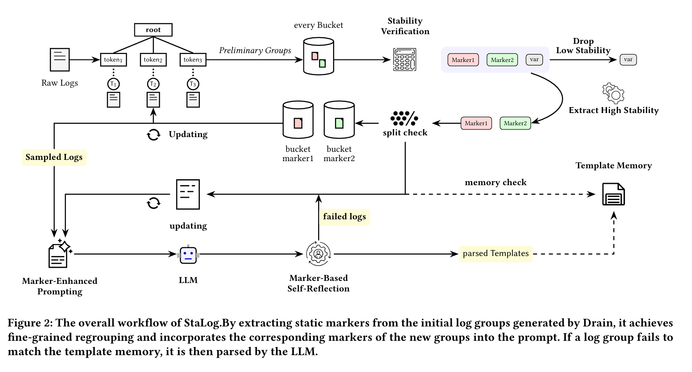
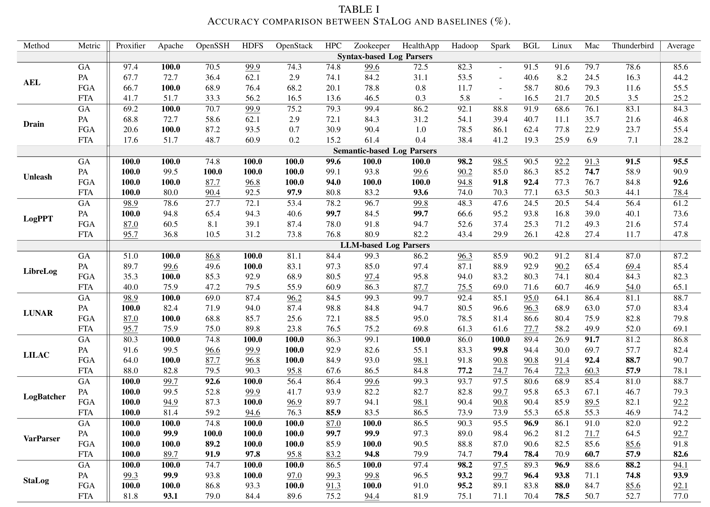
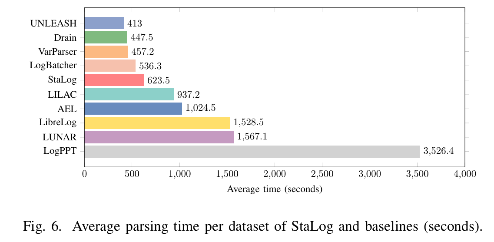
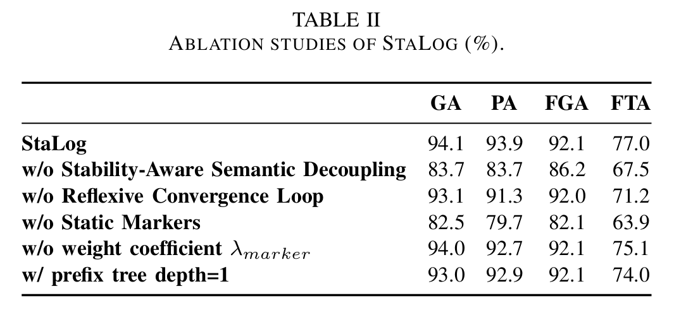
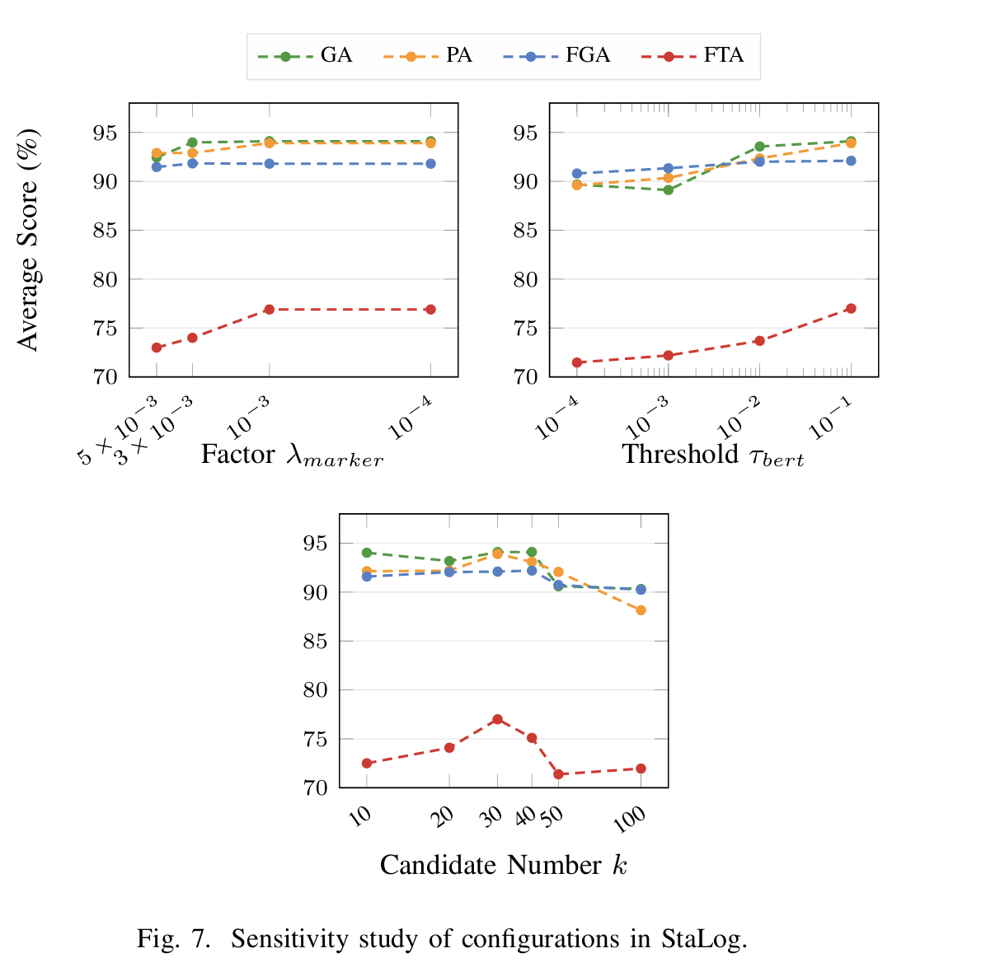
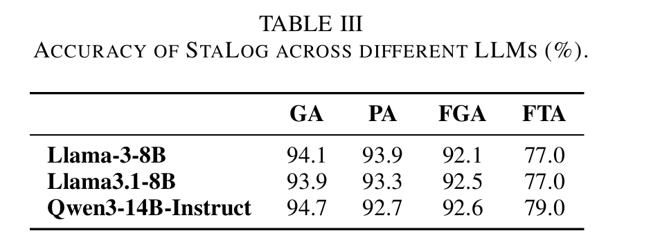

# StaLog:LLM-basedUnsupervisedStatic-AwareLogParsing

## Overall workflow of StaLog

<p align="center"></p>


## Structure
We present StaLog repository structure below.

```
.
├── README.md
├── docs
│   └── work_flow.pdf
├── evaluation
│   ├── RQ1
│   │   └── RQ1.png
│   ├── RQ2
│   │   └── RQ2_1.png
│   │   ├── RQ2_2.png
│   │   └── RQ2_3.pdf
│   ├── RQ3
│   │   └── RQ3_1.pdf
├── full_dataset
│   └── README.md
├── models
│   └── README.md
├── parser
│   ├── accuracy.py
│   ├── evaluator.py
│   ├── auto_marker_generator.py
│   ├── grouping.py
│   ├── llama_parser.py
│   └── regex_manager.py
├── parsing.sh
├── requirements.txt
└── results
    └── StaLog.csv
```


## Requirement 

```shell
pip install -r requirements.txt
```

## Models download

Please download the base LLM (Meta-Llama-3-8B-Instruct) from [Huggingface](https://huggingface.co/meta-llama/Meta-Llama-3-8B-Instruct).


## Datasets download

Please first download the full datasets of Loghub-2.0 via [Zenodo](https://zenodo.org/record/8275861).


## Parsing

Please run the following command to run StaLog.
```shell
sh parsing.sh
```


## Evaluation Results
### RQ1: Howe ffective is StaLog??
<p align="center"></p>

### RQ2: How do different settings affect StaLog?
<p align="center"></p>
<p align="center"></p>
<p align="center"></p>
### RQ3: Howe fficient is StaLog?
<p align="center"></p>

