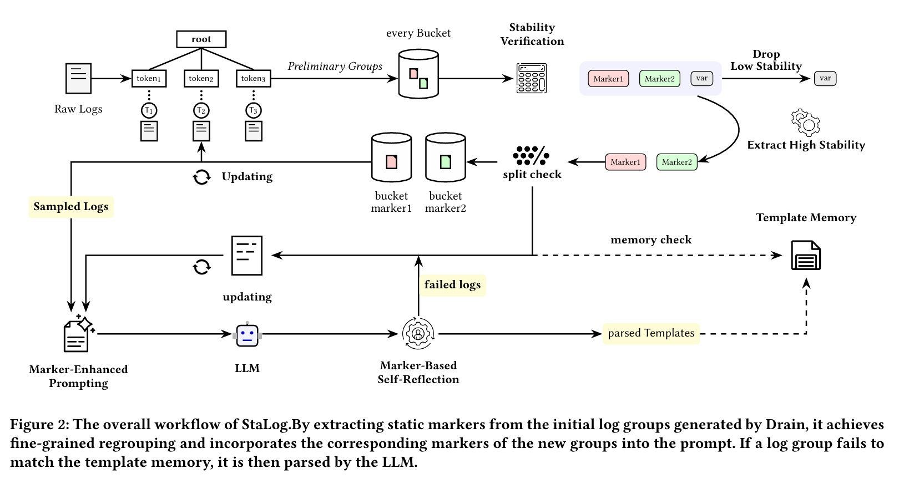
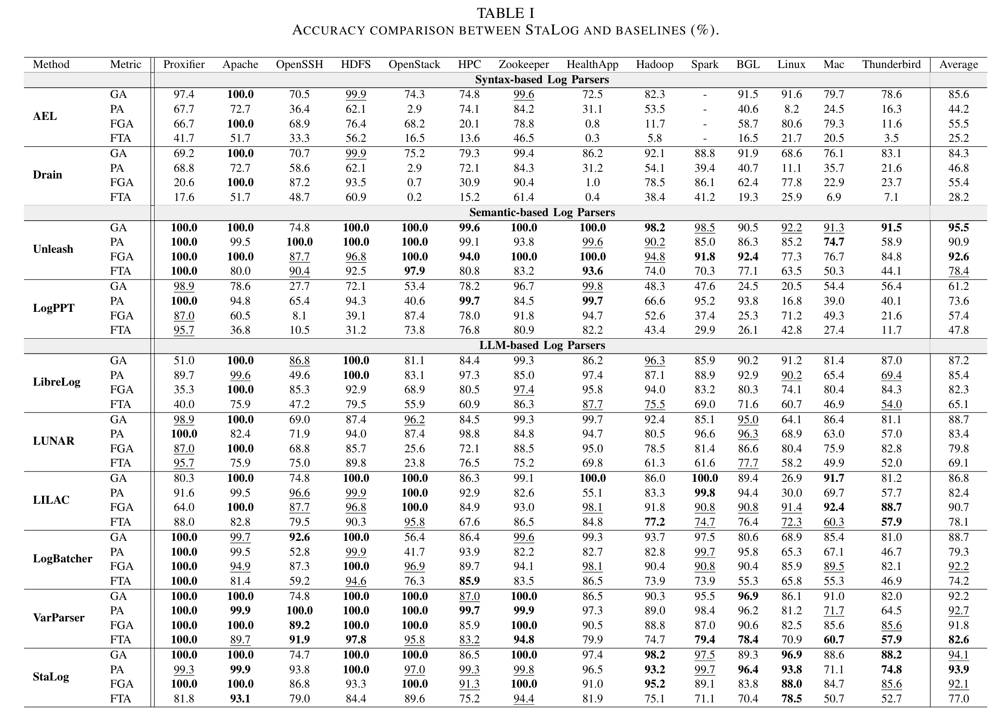
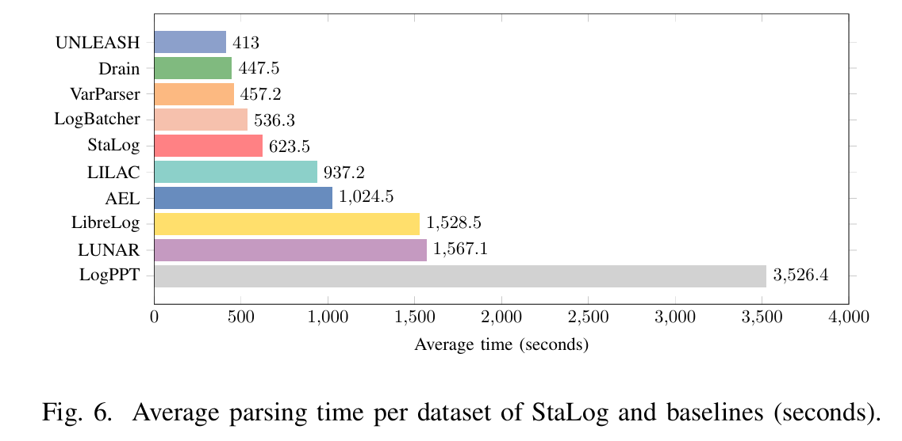
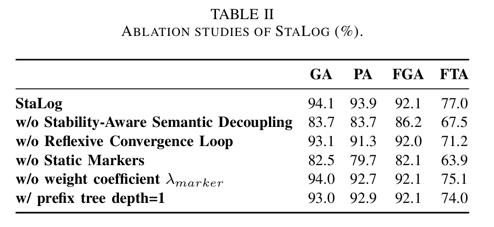
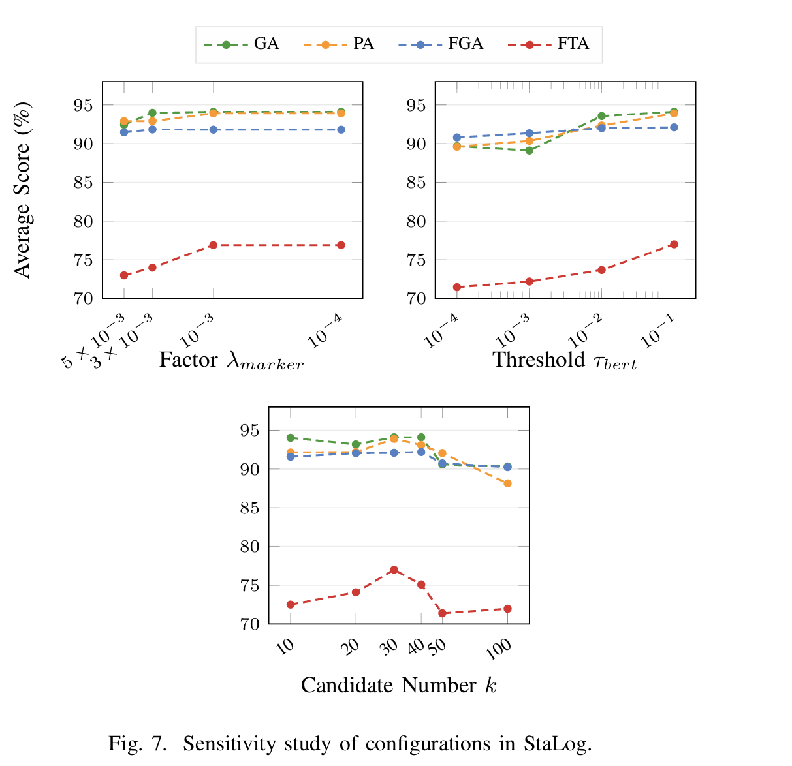
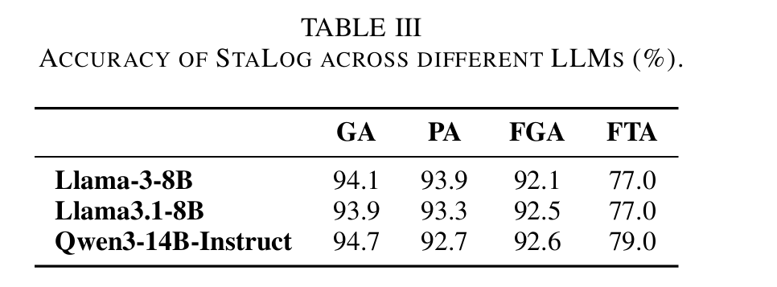

# StaLog:LLM-basedUnsupervisedStatic-AwareLogParsing

## Overall workflow of StaLog

<p align="center"></p>


## Structure
We present StaLog repository structure below.

```
.
├── README.md
├── docs
│   └── work_flow.pdf
├── evaluation
│   ├── RQ1
│   │   └── RQ1.png
│   ├── RQ2
│   │   └── RQ2_1.png
│   │   ├── RQ2_2.png
│   │   └── RQ2_3.pdf
│   ├── RQ3
│   │   └── RQ3_1.pdf
├── full_dataset
│   └── README.md
├── models
│   └── README.md
├── parser
│   ├── accuracy.py
│   ├── evaluator.py
│   ├── auto_marker_generator.py
│   ├── grouping.py
│   ├── llama_parser.py
│   └── regex_manager.py
├── parsing.sh
├── requirements.txt
└── results
    └── StaLog.csv
```


## Requirement 
Ensure you have Python 3.9.23+ installed.
```shell
pip install -r requirements.txt
```

## Models download

Please download the base LLM (Meta-Llama-3-8B-Instruct) from [Huggingface](https://huggingface.co/meta-llama/Meta-Llama-3-8B-Instruct).

The VRAM requirements for running the Meta Llama 3 8B model are as follows:  
FP16 (Half-precision / default full-parameter inference): Requires 16-18 GB VRAM. Recommended GPUs: RTX 4090 (24 GB), L40S (48 GB), RTX 4080, and other devices with more than 16 GB of VRAM.  
INT8 / FP8 (8-bit quantization): Requires 8 GB to 8.8 GB VRAM. Recommended GPUs: RTX 3060 (12 GB), RTX 4070 (12 GB), and other devices with more than 10 GB of VRAM.

Put the models into the following directory:
```txt
models/
```

## Datasets download

Please first download the full datasets of Loghub-2.0 via [Zenodo](https://zenodo.org/record/8275861).
Unzip the files into the following directory:
```txt
full_dataset/
```
Example structure:

```txt
📦 Stalog
├─ full_dataset
│     ├─ Apache
│     │  ├─ Apache_full.log
│     │  ├─ Apache_full.log_structured.csv
│     │  ├─ Apache_full.log_structured_corrected.csv
│     │  ├─ Apache_full.log_templates.csv
│     │  └─ Apache_full.log_templates_corrected.csv
│     ├─ ...
```


## Parsing

Please run the following command to run StaLog.
```shell
sh parsing.sh
```
Parsed log results will be saved to:
```txt
result/
```
static determination accuracy results will be saved to:
```txt
parser/
```

## Evaluation Results
### RQ1: Howe ffective is StaLog??
<p align="center"></p>

### RQ2: How do different settings affect StaLog?
<p align="center"></p>
<p align="center"></p>
<p align="center"></p>

### RQ3: How does Stalog perform on different LLMs?
<p align="center"></p>

